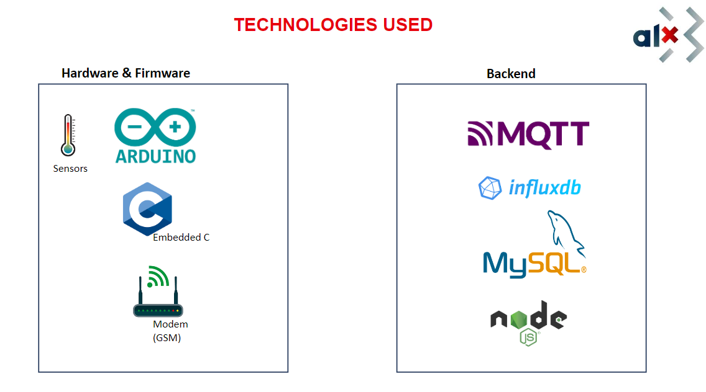
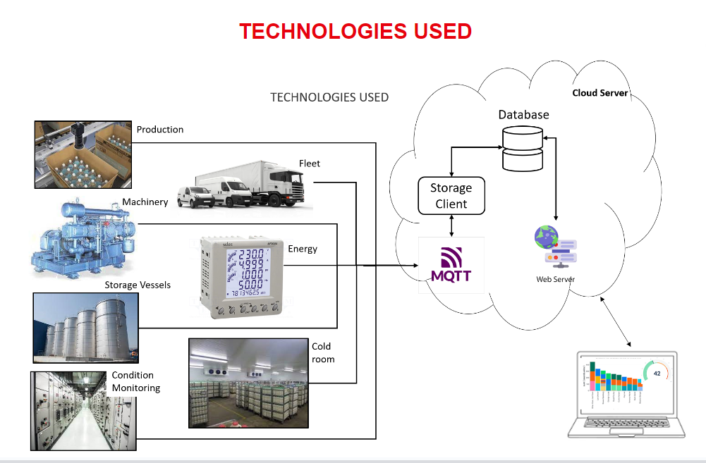

# Asset Monitoring and Tracking application

## Introduction
---
In today's dynamic and competitive business landscape, efficiency, productivity, and cost-effectiveness are paramount to success. Real-time data collection and equipment monitoring offer a transformative solution to streamline operations, enhance decision-making, and achieve high levels of profitability.

Accurate data is always necessary, as they are always used to validate management business decisions.
This project is aimed at preventing staffs form forging or altering production data or just have some good looking data to send to their manager which ends up misleading management.

This project is a cloud-based asset tracking web application that offers reports to help businesses maintain accurate and structured data. This is absolutely necessary to document asset workflows and spot consumption trends. By monitoring equipment performance and identifying bottlenecks, organizations can optimize resource allocation, reduce downtime, and maximize output.

## LEARNING OBJECTIVES
---
The primary objective is to utilize my software engineering skills learned at alx to solve common problem faced by industries and individuals. By the end of the project, I will be able to extract data from real life events and occurrences and make analyses with softwares and algorithms to improve how business is run.

I am focusing the project on only Asset tracking but it can be applied to various fields such as medical, wildlife and others

## DESIGN FUCUS
- Asset Health tracking
- Asset Location tracking and reporting
- Asset Utilization and performance tracking
- Energy consumption tracking.
- Raw materials consumption reports
- Data integrity and theft detection

